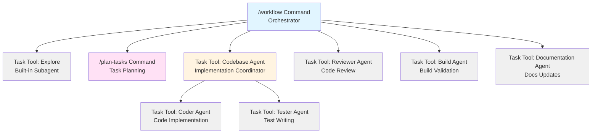
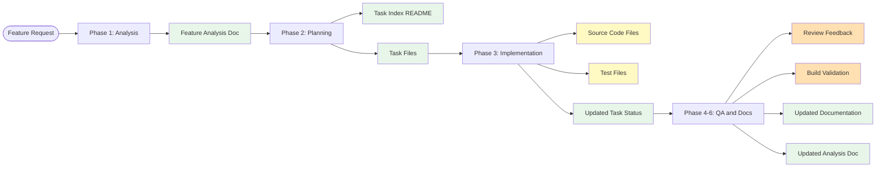

# Agent Workflow Diagram

## Complete Feature Development Flow

```mermaid
flowchart TD
    Start([User Request]) --> Orchestrator[/workflow Command]

    Orchestrator --> BranchCheck{On main/master<br/>branch?}

    BranchCheck -->|Yes| CreateBranch["Create Feature Branch<br/>feature/{feature-name}"]
    BranchCheck -->|No| Decision{Request Type?}
    CreateBranch --> Decision

    Decision -->|Simple Task| SimpleRoute[Direct Implementation]
    SimpleRoute --> Review[Reviewer Agent]
    SimpleRoute --> Build[Build Agent]
    SimpleRoute --> Coder[Coder Agent]
    SimpleRoute --> Docs[Documentation Agent]

    Decision -->|Complex Feature| Phase1[Phase 1: Analysis]

    Phase1 --> PatternAnalysis[Task Tool: Explore Subagent<br/>Analyze Codebase Patterns]
    PatternAnalysis --> AnalysisDoc[Create Analysis Doc<br/>docs/feature-analysts/feature.md]

    AnalysisDoc --> Phase2[Phase 2: Planning]
    Phase2 --> TaskManager[/plan-tasks Command]
    TaskManager --> TaskPlan[Create Task Plan<br/>tasks/subtasks/feature/]
    TaskPlan --> Approval{User Approval?}

    Approval -->|No| TaskManager
    Approval -->|Yes| Phase3[Phase 3: Implementation]

    Phase3 --> CodebaseImpl[Task Tool: Codebase Agent<br/>Implementation Mode]

    CodebaseImpl --> SubtaskLoop{More Subtasks?}

    SubtaskLoop -->|Yes| MarkStarted["Codebase Agent:<br/>Mark \\[ \\] → \\[~\\] in Feature Index"]
    MarkStarted --> ReadSubtask["Codebase Agent:<br/>Read Subtask seq-task.md"]
    ReadSubtask --> CoderAgent["Task Tool: Coder Agent<br/>Implement Code<br/>Mark Acceptance Criteria in Subtask"]
    CoderAgent --> TesterAgent["Task Tool: Tester Agent<br/>Write & Run Tests<br/>Mark Test Checklists in Subtask"]
    TesterAgent --> Validate["Codebase Agent:<br/>Validate Type Check, Lint, Tests"]
    Validate --> VerifyUpdates["Codebase Agent:<br/>Verify Subtask File Updated<br/>Fallback: Update if Missing"]
    VerifyUpdates --> UpdateStatus["Codebase Agent:<br/>Mark \\[~\\] → \\[x\\] in Feature Index"]
    UpdateStatus --> SubtaskLoop

    SubtaskLoop -->|No| FinalValidation[Final Validation<br/>Run Full Test Suite<br/>Verify Dev Environment]
    FinalValidation --> Phase4[Phase 4: Quality Assurance]

    Phase4 --> ReviewerAgent[Task Tool: Reviewer Agent<br/>Code Review<br/>Verify Acceptance Criteria]
    ReviewerAgent --> Phase5[Phase 5: Build Validation]

    Phase5 --> BuildAgent[Task Tool: Build Agent<br/>Build & Environment Check<br/>Docker/Local Dev Validation]
    BuildAgent --> Phase6[Phase 6: Documentation]

    Phase6 --> DocsAgent[Task Tool: Documentation Agent<br/>Update Docs & Analysis]
    DocsAgent --> UpdatePatterns[Update Analysis Doc<br/>docs/feature-analysts/feature.md]
    UpdatePatterns --> Phase7[Phase 7: Pull Request]

    Phase7 --> PRCheck{On feature<br/>branch?}
    PRCheck -->|Yes| CreatePR["Push Branch & Create PR<br/>gh pr create"]
    PRCheck -->|No| SkipPR["Skip PR Creation<br/>On main/master"]

    CreatePR --> Complete([Feature Complete])
    SkipPR --> Complete

    Review --> SimpleComplete([Task Complete])
    Build --> SimpleComplete
    Coder --> SimpleComplete
    Docs --> SimpleComplete

    style Orchestrator fill:#e1f5ff
    style PatternAnalysis fill:#fff4e1
    style TaskManager fill:#ffe1f5
    style CodebaseImpl fill:#fff4e1
    style CoderAgent fill:#f0f0f0
    style TesterAgent fill:#f0f0f0
    style ReviewerAgent fill:#f0f0f0
    style BuildAgent fill:#f0f0f0
    style DocsAgent fill:#f0f0f0
    style AnalysisDoc fill:#e8f5e9
    style TaskPlan fill:#e8f5e9
    style UpdatePatterns fill:#e8f5e9
```

## Agent Hierarchy



## Artifacts Created During Flow



## Phase Details

### Phase 0: Git Branch Check
- **Command:** `/workflow`
- **Purpose:** Ensure work happens on feature branches, not main/master
- **Workflow:**
  1. Check current branch with `git branch --show-current`
  2. If on main/master: Prompt user to create feature branch
  3. If user confirms: Create and checkout `feature/{feature-name}`
  4. If user declines: Warn and proceed on main/master
  5. If already on feature branch: Proceed without changes
- **Safety:** Prevents accidental commits to main/master branch
- **Best Practice:** All feature work should happen on dedicated branches

### Phase 1: Analysis
- **Tool:** Task tool with Explore subagent
- **Output:** `docs/feature-analysts/{feature}.md`
- **Purpose:** Understand existing codebase patterns relevant to the feature request
- **Extracts:** Development environment setup, validation commands (lint, format, test, build)
- **How:** Uses Claude Code's built-in Explore subagent for thorough codebase analysis

### Phase 2: Planning
- **Command:** `/plan-tasks`
- **Input:** Pattern analysis from Phase 1
- **Output:** Task plan in `tasks/subtasks/{feature}/`
- **Purpose:** Break down feature into atomic subtasks with comprehensive templates
- **Task Structure:** Status tracking, acceptance criteria, dependencies, implementation details, test requirements

### Phase 3: Implementation
- **Agent:** Codebase Agent (via Task tool)
- **Subagents:** Coder Agent, Tester Agent (via Task tool)
- **Output:** Source code + tests + updated task status + marked acceptance criteria
- **Purpose:** Implement each subtask sequentially
- **Status Tracking Workflow:**
  1. **Codebase Agent** marks `[ ]` → `[~]` in feature index (`README.md`)
  2. **Coder Agent** marks acceptance criteria in subtask file (`{seq}-task.md`)
  3. **Coder Agent** adds implementation section to subtask file
  4. **Tester Agent** adds test results section to subtask file
  5. **Codebase Agent** verifies subtask file updates (fallback: updates if missing)
  6. **Codebase Agent** marks `[~]` → `[x]` in feature index
- **Responsibility:** Codebase Agent owns feature index status, Coder/Tester own subtask file updates
- **Final Validation:** Runs full test suite and verifies dev environment (Docker/local)

### Phase 4: Quality Assurance
- **Agent:** Reviewer Agent (via Task tool)
- **Output:** Code review feedback + acceptance criteria verification
- **Purpose:** Validate code quality, security, and acceptance criteria
- **Verification:** Reads task files and confirms each acceptance criterion is actually met in the code
- **Flags:** Criteria marked as complete but not actually implemented
- **Signature:** Starts with "Reviewing..., what would you devs do if I didn't check up on you?"

### Phase 5: Build Validation
- **Agent:** Build Agent (via Task tool)
- **Output:** Build validation results + environment verification
- **Purpose:** Ensure project builds AND runs successfully in its development environment
- **Validates:**
  - Type checking
  - Build process
  - Docker containers start successfully (if Docker-based)
  - Dev server starts without errors (if local development)
  - Uses project-specific commands from feature analysis

### Phase 6: Documentation
- **Agent:** Documentation Agent (via Task tool)
- **Output:** Updated documentation (README, API docs, feature analysis docs)
- **Purpose:** Keep docs current with changes and update feature analysis documentation with new patterns discovered during implementation
- **Analysis Update:** Reviews implementation and updates `docs/feature-analysts/{feature}.md` to prevent drift

### Phase 7: Pull Request Creation
- **Command:** `/workflow`
- **Output:** Pull request (if on feature branch)
- **Purpose:** Create PR for code review and merge approval
- **Workflow:**
  1. Check if on feature branch
  2. If yes: Push branch and create PR with summary
  3. If no (on main/master): Skip PR creation, warn user
- **PR Contents:**
  - Summary of changes from all commits
  - List of completed tasks
  - Links to feature documentation
  - Validation status (tests, build, lint)
- **Commands Used:** `git push -u origin {branch}`, `gh pr create`

## Claude Code Architecture

### How Agents are Invoked

Claude Code uses the **Task tool** to invoke specialized agents:

```markdown
Use the Task tool with:
- subagent_type: "general-purpose"
- model: "haiku" (or "sonnet" for complex tasks)
- description: "Brief description"
- prompt: "[Load full agent prompt from .claude/agents/{agent}.md]

  ## Context
  Feature: {feature-name}
  Task: {task-details}
  ..."
```

### Agent Prompts Location

All agent prompts stored in `.claude/agents/`:
- `codebase-agent.md` - Implementation orchestrator
- `coder-agent.md` - Code implementation
- `tester.md` - Test writing
- `reviewer.md` - Code review
- `build-agent.md` - Build validation
- `documentation.md` - Documentation updates

### Slash Commands

User-facing commands in `.claude/commands/`:
- `/workflow` - Complete feature development workflow
- `/plan-tasks` - Task planning and breakdown

### Key Differences from Traditional Systems

1. **No YAML Config:** Agent behavior controlled by prompt content
2. **Task Tool Invocation:** Agents invoked via Task tool, not direct reference
3. **Dynamic Context:** Context passed to agents at runtime
4. **Hierarchical Execution:** Agents can invoke sub-agents
5. **Stateless:** Each agent invocation is independent

### Agent Coordination

```
/workflow (user invokes)
  ↓
workflow.md reads agent prompt
  ↓
Task tool invocation with full prompt + context
  ↓
Agent executes with instructions
  ↓
Agent can invoke sub-agents (e.g., codebase → coder)
  ↓
Results flow back to workflow
  ↓
Next phase begins
```

This architecture provides explicit, customizable agent behavior while maintaining the structured workflow of the OpenCode system.
