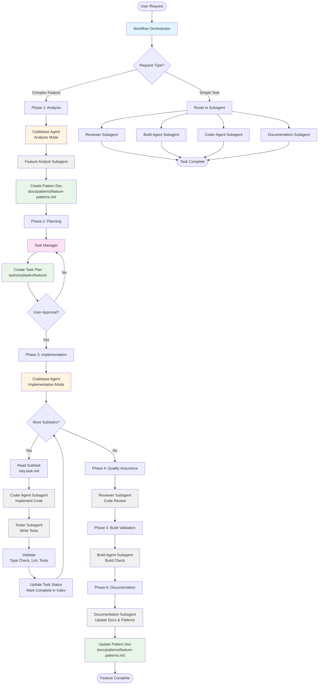
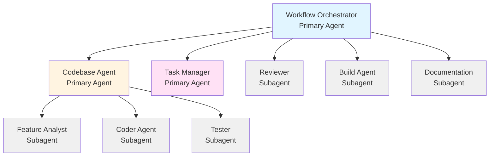
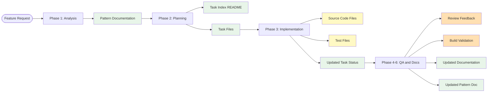

# Agent Workflow Diagram

## Complete Feature Development Flow

## Agent Hierarchy

## Artifacts Created During Flow

## Phase Details

### Phase 1: Analysis
- **Agent:** @codebase-agent (analysis mode)
- **Subagent:** @feature-analyst
- **Output:** `docs/patterns/{feature}-patterns.md`
- **Purpose:** Understand existing codebase patterns relevant to the feature request

### Phase 2: Planning
- **Agent:** @task-manager
- **Input:** Pattern analysis from Phase 1
- **Output:** Task plan in `tasks/subtasks/{feature}/`
- **Purpose:** Break down feature into atomic subtasks

### Phase 3: Implementation
- **Agent:** @codebase-agent (implementation mode)
- **Subagents:** @coder-agent, @tester
- **Output:** Source code + tests + updated task status
- **Purpose:** Implement each subtask sequentially

### Phase 4: Quality Assurance
- **Subagent:** @reviewer
- **Output:** Code review feedback
- **Purpose:** Validate code quality and security

### Phase 5: Build Validation
- **Subagent:** @build-agent
- **Output:** Build validation results
- **Purpose:** Ensure project compiles successfully

### Phase 6: Documentation
- **Subagent:** @documentation
- **Output:** Updated documentation (README, API docs, pattern docs)
- **Purpose:** Keep docs current with changes and update pattern documentation with new patterns discovered during implementation
- **Pattern Update:** Reviews implementation and updates `docs/patterns/{feature}-patterns.md` to prevent drift
