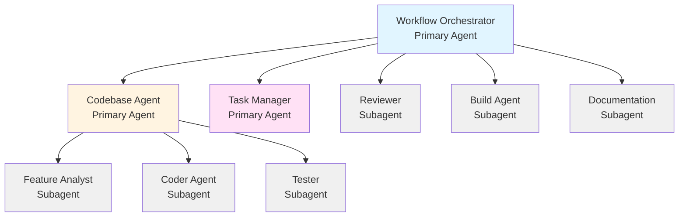
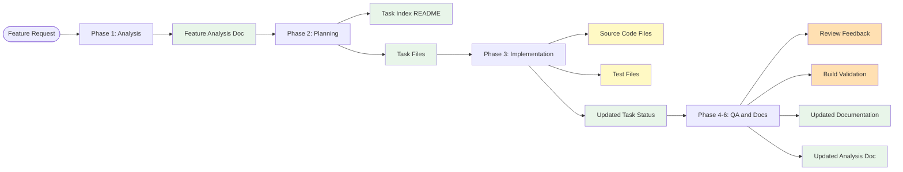

# Agent Workflow Diagram

## Complete Feature Development Flow

```mermaid
flowchart TD
    Start([User Request]) --> Orchestrator[Workflow Orchestrator]
    
    Orchestrator --> Decision{Request Type?}
    
    Decision -->|Simple Task| SimpleRoute[Route to Subagent]
    SimpleRoute --> Review[Reviewer Subagent]
    SimpleRoute --> Build[Build Agent Subagent]
    SimpleRoute --> Coder[Coder Agent Subagent]
    SimpleRoute --> Docs[Documentation Subagent]
    
    Decision -->|Complex Feature| Phase1[Phase 1: Analysis]
    
    Phase1 --> CodebaseAnalysis[Codebase Agent<br/>Analysis Mode]
    CodebaseAnalysis --> FeatureAnalyst[Feature Analyst Subagent]
    FeatureAnalyst --> AnalysisDoc[Create Analysis Doc<br/>docs/feature-analysts/feature.md]
    
    AnalysisDoc --> Phase2[Phase 2: Planning]
    Phase2 --> TaskManager[Task Manager]
    TaskManager --> TaskPlan[Create Task Plan<br/>tasks/subtasks/feature/]
    TaskPlan --> Approval{User Approval?}
    
    Approval -->|No| TaskManager
    Approval -->|Yes| Phase3[Phase 3: Implementation]
    
    Phase3 --> CodebaseImpl[Codebase Agent<br/>Implementation Mode]
    
    CodebaseImpl --> SubtaskLoop{More Subtasks?}
    
    SubtaskLoop -->|Yes| MarkStarted[Codebase Agent:<br/>Mark [ ] → [~] in Feature Index]
    MarkStarted --> ReadSubtask[Codebase Agent:<br/>Read Subtask seq-task.md]
    ReadSubtask --> CoderAgent[Coder Agent Subagent:<br/>Implement Code<br/>Mark Acceptance Criteria in Subtask File]
    CoderAgent --> TesterAgent[Tester Subagent:<br/>Write & Run Tests<br/>Mark Test Checklists in Subtask File]
    TesterAgent --> Validate[Codebase Agent:<br/>Validate Type Check, Lint, Tests]
    Validate --> VerifyUpdates[Codebase Agent:<br/>Verify Subtask File Updated<br/>Fallback: Update if Missing]
    VerifyUpdates --> UpdateStatus[Codebase Agent:<br/>Mark [~] → [x] in Feature Index]
    UpdateStatus --> SubtaskLoop
    
    SubtaskLoop -->|No| FinalValidation[Final Validation<br/>Run Full Test Suite<br/>Verify Dev Environment]
    FinalValidation --> Phase4[Phase 4: Quality Assurance]
    
    Phase4 --> ReviewerAgent[Reviewer Subagent<br/>Code Review<br/>Verify Acceptance Criteria]
    ReviewerAgent --> Phase5[Phase 5: Build Validation]
    
    Phase5 --> BuildAgent[Build Agent Subagent<br/>Build & Environment Check<br/>Docker/Local Dev Validation]
    BuildAgent --> Phase6[Phase 6: Documentation]
    
    Phase6 --> DocsAgent[Documentation Subagent<br/>Update Docs & Analysis]
    DocsAgent --> UpdatePatterns[Update Analysis Doc<br/>docs/feature-analysts/feature.md]
    UpdatePatterns --> Complete([Feature Complete])
    
    Review --> SimpleComplete([Task Complete])
    Build --> SimpleComplete
    Coder --> SimpleComplete
    Docs --> SimpleComplete
    
    style Orchestrator fill:#e1f5ff
    style CodebaseAnalysis fill:#fff4e1
    style TaskManager fill:#ffe1f5
    style CodebaseImpl fill:#fff4e1
    style FeatureAnalyst fill:#f0f0f0
    style CoderAgent fill:#f0f0f0
    style TesterAgent fill:#f0f0f0
    style ReviewerAgent fill:#f0f0f0
    style BuildAgent fill:#f0f0f0
    style DocsAgent fill:#f0f0f0
    style AnalysisDoc fill:#e8f5e9
    style TaskPlan fill:#e8f5e9
    style UpdatePatterns fill:#e8f5e9
```

## Agent Hierarchy



## Artifacts Created During Flow



## Phase Details

### Phase 1: Analysis
- **Agent:** @codebase-agent (analysis mode)
- **Subagent:** @feature-analyst
- **Output:** `docs/feature-analysts/{feature}.md`
- **Purpose:** Understand existing codebase patterns relevant to the feature request
- **Extracts:** Development environment setup, validation commands (lint, format, test, build)

### Phase 2: Planning
- **Agent:** @task-manager
- **Input:** Pattern analysis from Phase 1
- **Output:** Task plan in `tasks/subtasks/{feature}/`
- **Purpose:** Break down feature into atomic subtasks with comprehensive templates
- **Task Structure:** Status tracking, acceptance criteria, dependencies, implementation details, test requirements

### Phase 3: Implementation
- **Agent:** @codebase-agent (implementation mode)
- **Subagents:** @coder-agent, @tester
- **Output:** Source code + tests + updated task status + marked acceptance criteria
- **Purpose:** Implement each subtask sequentially
- **Status Tracking Workflow:**
  1. **@codebase-agent** marks [ ] → [~] in feature index (`README.md`)
  2. **@coder-agent** marks acceptance criteria in subtask file (`{seq}-task.md`)
  3. **@coder-agent** adds implementation section to subtask file
  4. **@tester** adds test results section to subtask file
  5. **@codebase-agent** verifies subtask file updates (fallback: updates if missing)
  6. **@codebase-agent** marks [~] → [x] in feature index
- **Responsibility:** @codebase-agent owns feature index status, @coder-agent/@tester own subtask file updates
- **Final Validation:** Runs full test suite and verifies dev environment (Docker/local)

### Phase 4: Quality Assurance
- **Subagent:** @reviewer
- **Output:** Code review feedback + acceptance criteria verification
- **Purpose:** Validate code quality, security, and acceptance criteria
- **Verification:** Reads task files and confirms each acceptance criterion is actually met in the code
- **Flags:** Criteria marked as complete but not actually implemented

### Phase 5: Build Validation
- **Subagent:** @build-agent
- **Output:** Build validation results + environment verification
- **Purpose:** Ensure project builds AND runs successfully in its development environment
- **Validates:**
  - Type checking
  - Build process
  - Docker containers start successfully (if Docker-based)
  - Dev server starts without errors (if local development)
  - Uses project-specific commands from feature analysis

### Phase 6: Documentation
- **Subagent:** @documentation
- **Output:** Updated documentation (README, API docs, feature analysis docs)
- **Purpose:** Keep docs current with changes and update feature analysis documentation with new patterns discovered during implementation
- **Analysis Update:** Reviews implementation and updates `docs/feature-analysts/{feature}.md` to prevent drift
